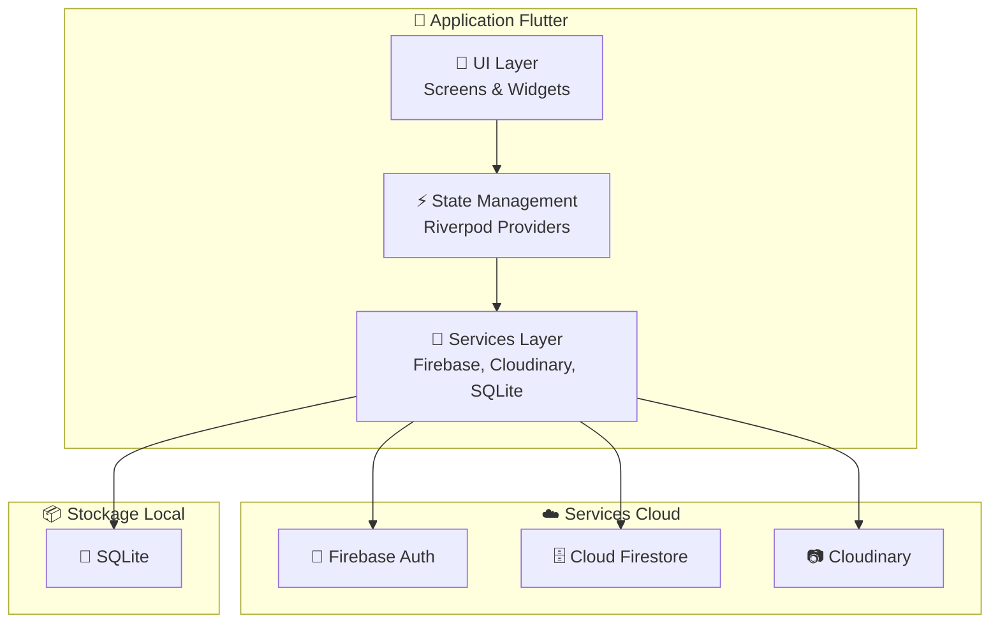
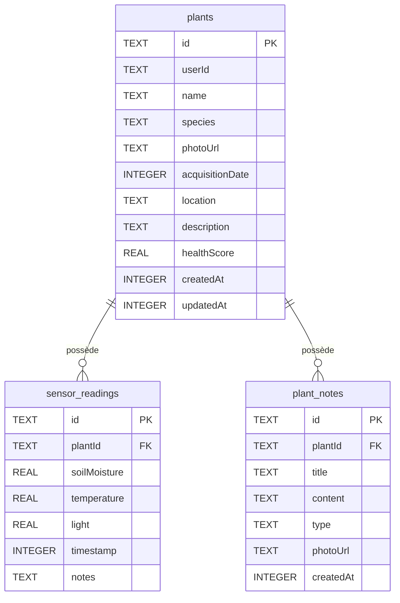
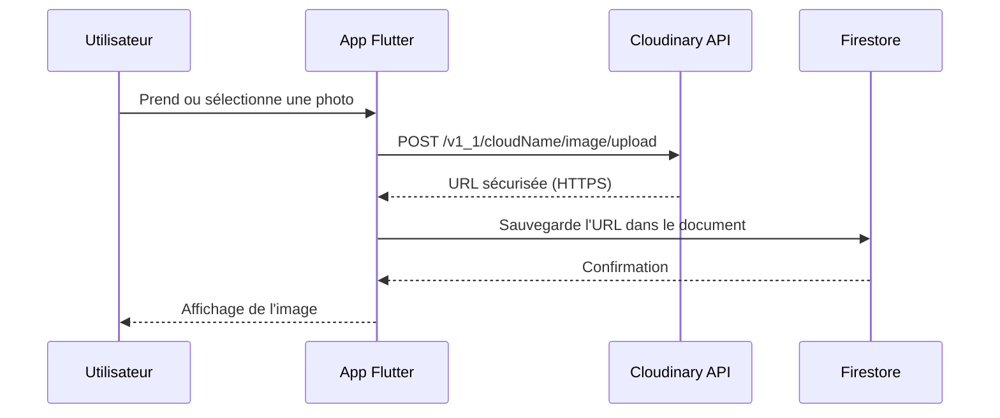

# 🌿 Rapport de Projet — JardinApp

## Application de Surveillance de Jardin/Plantes Connectée (Concept)

---

**Projet N°19** — Plateforme d'Application Mobile

| | |
|---|---|
| **Étudiant** | Medoune GUEYE |
| **Formation** | FAD Janvier 2026 — MIT |
| **Cours** | Plateforme d'Application |
| **Date** | 16 mars 2026 |
| **Technologies** | Flutter 3.38, Firebase, SQLite, Cloudinary |
| **Plateformes** | Android & iOS |
| **Dépôt GitHub** | [github.com/madutech7/jardinapp2026](https://github.com/madutech7/jardinapp2026) |

---

## Table des Matières

1. [Introduction et Contexte](#1-introduction-et-contexte)
2. [Architecture Technique](#2-architecture-technique)
3. [Fonctionnalités Implémentées](#3-fonctionnalités-implémentées)
   - 3.1 [Authentification Utilisateur](#31-authentification-utilisateur-firebase-auth)
   - 3.2 [Écran Principal — Mon Jardin](#32-écran-principal--mon-jardin)
   - 3.3 [Gestion des Plantes](#33-gestion-des-plantes)
   - 3.4 [Détail d'une Plante & Capteurs](#34-détail-dune-plante--capteurs-simulés)
   - 3.5 [Notes & Observations](#35-notes--observations)
   - 3.6 [Historique des Capteurs](#36-historique-des-capteurs)
   - 3.7 [Rappels d'Entretien](#37-rappels-dentretien)
   - 3.8 [Encyclopédie des Espèces](#38-encyclopédie-des-espèces)
   - 3.9 [Profil Utilisateur](#39-profil-utilisateur)
4. [Persistance Locale (SQLite)](#4-persistance-locale-sqlite)
5. [Gestion des Images (Cloudinary)](#5-gestion-des-images-cloudinary)
6. [Design System — MonJardin](#6-design-system--monjardin)
7. [Déploiement CI/CD (Codemagic)](#7-déploiement-cicd-codemagic)
8. [Structure du Code Source](#8-structure-du-code-source)
9. [Défis Rencontrés et Solutions](#9-défis-rencontrés-et-solutions)
10. [Conclusion](#10-conclusion)

---

## 1. Introduction et Contexte

**JardinApp** est une application mobile multiplateforme (Android & iOS) développée avec le framework **Flutter**. Elle permet à un utilisateur de gérer un jardin virtuel : enregistrer ses plantes, suivre leur état de santé via des lectures de capteurs simulées, prendre des notes d'observation et recevoir des rappels d'entretien.

Le projet s'inscrit dans une démarche de conception centrée utilisateur : l'interface se veut intuitive, visuellement riche et professionnelle, baptisée **« MonJardin »** — un design system inspiré de la nature avec des tons verts émeraude, des animations fluides et une typographie moderne.

> [!NOTE]
> L'application simule l'interaction avec des capteurs IoT (humidité du sol, température, luminosité). Dans un scénario réel, ces données proviendraient de capteurs physiques connectés via Bluetooth ou Wi-Fi.

---

## 2. Architecture Technique

L'application repose sur une architecture **modulaire à trois couches** combinant des services cloud et une base de données locale :



### Stack Technologique

| Composant | Technologie | Rôle |
|---|---|---|
| **Framework** | Flutter 3.38 / Dart 3.10 | Développement multiplateforme |
| **State Management** | Riverpod 3.3 | Gestion réactive de l'état |
| **Navigation** | GoRouter 17.1 | Routage déclaratif avec redirection |
| **Authentification** | Firebase Auth 6.2 | Inscription, connexion, gestion de compte |
| **Base de données cloud** | Cloud Firestore 6.1 | Stockage en temps réel des plantes, notes, rappels |
| **Stockage d'images** | Cloudinary | Upload et hébergement des photos |
| **Base de données locale** | SQLite (sqflite 2.4) | Cache hors-ligne |
| **Graphiques** | fl_chart 1.2 | Visualisation de l'évolution des capteurs |
| **CI/CD** | Codemagic | Build automatisé Android & iOS |

> [!IMPORTANT]
> **Choix de Cloudinary au lieu de Firebase Storage** : Firebase Storage est un service payant au-delà du quota gratuit. Pour optimiser les coûts du projet, le service **Cloudinary** a été choisi comme alternative gratuite pour l'hébergement des images (photos de plantes et de profil). L'upload se fait via l'API REST avec un *upload preset* non signé.

---

## 3. Fonctionnalités Implémentées

### 3.1 Authentification Utilisateur (Firebase Auth)

L'application utilise **Firebase Authentication** pour gérer les comptes utilisateurs de manière sécurisée :

- **Inscription** par email et mot de passe avec validation des champs
- **Connexion** avec gestion des erreurs (identifiants invalides, compte inexistant)
- **Réinitialisation du mot de passe** par email
- **Déconnexion** sécurisée
- **Suppression de compte** avec confirmation

Le flux d'authentification est géré par un **GoRouter redirect** : si l'utilisateur n'est pas connecté, il est automatiquement redirigé vers l'écran de connexion. Une fois authentifié, il accède directement à son jardin.

```dart
// Extrait de router.dart — Redirection automatique
redirect: (context, state) {
  final isLoggedIn = authState.value != null;
  final isAuthRoute = state.matchedLocation == '/login' 
                   || state.matchedLocation == '/register';
  if (!isLoggedIn && !isAuthRoute) return '/login';
  if (isLoggedIn && isAuthRoute) return '/garden';
  return null;
},
```

---

### 3.2 Écran Principal — Mon Jardin

L'écran principal constitue le **tableau de bord** de l'application. Il offre une vue d'ensemble complète du jardin de l'utilisateur.


#### Éléments visibles sur cet écran :

| Élément | Description |
|---|---|
| **Message d'accueil dynamique** | « Bonjour », « Bon après-midi » ou « Bonsoir » selon l'heure locale |
| **Photo de profil** | Affichée en haut à droite, cliquable pour accéder au profil |
| **Tableau de bord « État Global »** | Carte blanche avec anneau de santé animé (84%) et nombre de rappels |
| **Grille « Mes Plantes »** | Affichage en grille 2 colonnes avec photo, nom scientifique, surnom et score de santé |
| **Tâches recommandées** | Bande horizontale défilable montrant les rappels en attente (ex: « Arroser Menthe ») |
| **Bouton flottant (+)** | Permet d'ajouter rapidement une nouvelle plante |
| **Barre de navigation** | 4 onglets : Jardin, Rappels, Espèces, Profil |

> [!TIP]
> Chaque carte de plante affiche un **badge de santé coloré** (vert = en forme, bleu = besoin d'eau) calculé dynamiquement à partir des dernières lectures de capteurs. L'anneau de santé principal utilise un `CustomPainter` avec un dégradé `SweepGradient` pour un rendu premium.

---

### 3.3 Gestion des Plantes

L'écran d'ajout de plante permet de créer un profil complet pour chaque végétal du jardin.


#### Champs du formulaire :

| Champ | Type | Description |
|---|---|---|
| **Photo** | Image (caméra ou galerie) | Upload automatique vers Cloudinary |
| **Nom de la plante** | Texte obligatoire | Nom personnalisé (ex: « Manguiers ») |
| **Espèce / Variété** | Texte obligatoire | Nom scientifique (ex: « Mangifera indica ») |
| **Date d'acquisition** | Date picker | Sélecteur de date avec format français |
| **Emplacement** | Texte optionnel | Position dans le jardin (ex: « Plein soleil ») |
| **Description** | Texte multiligne | Notes libres sur la plante |

#### Fonctionnalité de reconnaissance d'espèce :
Lorsque l'utilisateur saisit une espèce connue, l'application affiche un **bandeau vert « Espèce reconnue »** confirmant que l'espèce est présente dans l'encyclopédie intégrée. Cela permet de lier automatiquement la plante à sa fiche encyclopédique pour des conseils d'entretien personnalisés.

```dart
// Stockage des données dans Firestore
Map<String, dynamic> toFirestore() {
  return {
    'userId': userId,
    'name': name,
    'species': species,
    'photoUrl': photoUrl,      // URL Cloudinary
    'acquisitionDate': Timestamp.fromDate(acquisitionDate),
    'healthScore': healthScore, // Score de 0 à 100
    'createdAt': Timestamp.fromDate(createdAt),
  };
}
```

---

### 3.4 Détail d'une Plante & Capteurs Simulés

L'écran de détail est le cœur fonctionnel de l'application. Il présente toutes les informations d'une plante avec ses données de capteurs.


#### Partie supérieure — Fiche de la plante :
- **Photo en plein écran** avec effet parallaxe
- Nom scientifique en lettres capitales dorées
- **Nom personnalisé** en grande typographie
- Tags d'emplacement et date d'acquisition
- **Anneau de santé** (100% — « En bonne santé ») avec animation élastique
- Section « À propos » avec la description de la plante
- Lien vers l'**Encyclopédie MonJardin** pour consulter la fiche de l'espèce

#### Partie inférieure — Capteurs en Temps Réel :
Les trois capteurs simulés sont affichés dans des cartes individuelles avec des jauges de progression colorées :

| Capteur | Valeur Exemple | Icône | Couleur |
|---|---|---|---|
| **Humidité du sol** | 51.5% | 💧 | Bleu |
| **Température** | 22.6°C | 🌡️ | Marron |
| **Lumière** | 50.7% | ☀️ | Jaune/Orange |

#### Simulation des données :
Le bouton **« Simuler une lecture capteur »** génère des valeurs réalistes grâce à un algorithme d'évolution graduelle :

```dart
// Extrait de SensorSimulator — Génération réaliste
static SensorReading generateReading(String plantId, {SensorReading? previous}) {
  if (previous != null) {
    // Évolution graduelle par rapport à la dernière lecture
    moisture = (previous.soilMoisture + (random.nextDouble() * 20 - 12)).clamp(10, 95);
    temp = (previous.temperature + (random.nextDouble() * 4 - 2)).clamp(5, 40);
    light = (previous.light + (random.nextDouble() * 30 - 15)).clamp(5, 100);
  } else {
    // Nouvelle lecture complètement aléatoire
    moisture = 30 + random.nextDouble() * 50;
    temp = 18 + random.nextDouble() * 12;
    light = 40 + random.nextDouble() * 50;
  }
}
```

#### Graphique d'évolution :
Un graphique de type **LineChart** (bibliothèque `fl_chart`) affiche l'évolution de l'humidité du sol dans le temps, permettant de visualiser les tendances et d'anticiper les besoins d'arrosage.

#### Actions rapides :
Trois boutons d'action permettent des interactions directes :
- 💧 **Arroser Maintenant** — Enregistre un arrosage immédiat
- 📝 **Ajouter une Note** — Ouvre le formulaire de notes
- 🕐 **Historique Capteurs** — Accède à l'historique complet

---

### 3.5 Notes & Observations

La fonctionnalité de notes permet de tenir un **journal d'observation** pour chaque plante.


#### Catégories de notes disponibles :

| Catégorie | Usage | Couleur |
|---|---|---|
| **Général** | Observations courantes | Vert |
| **Problème** | Maladies, parasites, feuilles jaunies | Rouge |
| **Traitement** | Actions correctives appliquées | Bleu |
| **Observation** | Croissance, floraison, fruits | Jaune |

Chaque note comprend un **titre**, une **description** détaillée, et la possibilité d'ajouter une **photo** prise sur le vif (via la caméra) ou depuis la galerie. Les notes sont stockées dans une sous-collection Firestore liée à la plante concernée.

---

### 3.6 Historique des Capteurs

L'écran d'historique présente une **vue chronologique** de toutes les lectures de capteurs enregistrées pour une plante donnée.

Visible sur la partie droite de la capture précédente, chaque entrée affiche :
- **Date et heure** de la lecture (ex: « 16 mars 2026 – 22:10 »)
- **Score de santé** associé (badge vert « 100% santé »)
- Les trois valeurs de capteurs avec leurs jauges respectives
- Possibilité de **suppression par glissement** (swipe-to-delete)

---

### 3.7 Rappels d'Entretien

Le système de rappels permet à l'utilisateur de planifier et suivre l'entretien de son jardin.


#### Types de rappels supportés :

| Type | Icône | Description |
|---|---|---|
| **Arrosage** | 💧 | Programmation régulière de l'arrosage |
| **Engrais** | 🌱 | Application de fertilisant |
| **Taille** | ✂️ | Taille et élagage |
| **Rempotage** | 🪴 | Changement de pot |
| **Traitement** | 💊 | Application de produit phytosanitaire |
| **Autre** | 🔔 | Rappel personnalisé |

#### Fréquences disponibles :
- Quotidienne
- Hebdomadaire
- Mensuelle

#### Workflow d'un rappel :
1. L'utilisateur sélectionne la **plante** concernée
2. Il choisit le **type** de rappel et la **fréquence**
3. Il définit la **date prévue** de la première exécution
4. Le rappel apparaît dans la liste **« À venir »** avec un compteur
5. Il peut être **marqué comme complété** via un toggle switch
6. La **suppression par glissement** (icône poubelle rouge) est disponible

> [!NOTE]
> Les rappels en retard sont automatiquement signalés sur l'écran principal via le compteur dans le tableau de bord et les « Tâches recommandées ».

---

### 3.8 Encyclopédie des Espèces

L'encyclopédie intégrée constitue une **base de connaissances** sur les espèces végétales, focalisée sur la flore locale.


#### Espèces répertoriées (10 espèces) :

| Espèce | Nom Scientifique | Difficulté |
|---|---|---|
| Baobab | *Adansonia digitata* | 🟢 Facile |
| Manguier | *Mangifera indica* | 🟡 Intermédiaire |
| Bissap | *Hibiscus sabdariffa* | 🟢 Facile |
| Bougainvillier | *Bougainvillea* | 🟢 Facile |
| Flamboyant | *Delonix regia* | 🟡 Intermédiaire |
| Gommier | *Acacia senegal* | 🟡 Intermédiaire |
| Palmier à huile | *Elaeis guineensis* | 🟡 Intermédiaire |
| Fromager | *Ceiba pentandra* | 🔴 Difficile |
| Citronnier | *Citrus aurantifolia* | 🟡 Intermédiaire |
| Moringa | *Moringa oleifera* | 🟢 Facile |

#### Fonctionnalités de l'encyclopédie :
- **Barre de recherche** avec filtrage en temps réel
- **Filtres par difficulté** : Toutes, Facile, Intermédiaire, Difficile
- **Fiche détaillée** pour chaque espèce comprenant :
  - Description botanique complète
  - Besoins en eau, exposition, température et humidité
  - Type de sol recommandé
  - Conseils d'entretien pratiques
  - Problèmes courants et maladies à surveiller

> [!TIP]
> L'exemple visible du **Baobab** (*Adansonia digitata*) illustre la richesse des fiches : « L'emblème du Sénégal. Un arbre majestueux et sacré qui peut vivre des millénaires et stocker des milliers de litres d'eau. »

---

### 3.9 Profil Utilisateur

L'écran de profil centralise les informations personnelles et les paramètres de l'application.


#### Informations affichées :
- **Photo de profil** avec possibilité de modification (upload Cloudinary)
- **Nom complet** et **adresse email**
- **Statistiques du jardin** : Nombre de plantes (6), Santé moyenne (90%), Nombre d'espèces (6)

#### Paramètres du compte :
- **Modifier le profil** (nom, photo)
- **Notifications** (toggle on/off)
- **Sécurité** (changement de mot de passe)

#### Préférences :
- **Mode sombre** (toggle switch)
- **Langue** — Français (France)

#### Modification du profil :


L'écran de modification permet de :
- Changer la **photo de profil** via le bouton caméra
- Modifier le **nom complet**
- Accéder au dialogue de **changement de mot de passe** avec modal élégant

---

## 4. Persistance Locale (SQLite)

L'application implémente une **stratégie de cache local** via SQLite pour garantir un fonctionnement même sans connexion Internet.

### Schéma de la base de données locale :



### Stratégie de synchronisation :
1. **Écriture prioritaire dans Firestore** : Toutes les données sont d'abord envoyées dans le cloud
2. **Mise en cache automatique** : Chaque donnée reçue de Firestore est immédiatement sauvegardée dans SQLite
3. **Lecture hors-ligne** : En cas de perte de connexion, les données sont lues depuis le cache local

```dart
// Mise en cache automatique lors de la réception des données Firestore
final plantsStreamProvider = StreamProvider<List<PlantModel>>((ref) {
  return FirebaseService.streamCollection(FirebaseService.plantsRef, ...).map((snapshot) {
    final plants = snapshot.docs.map((doc) => PlantModel.fromFirestore(doc)).toList();
    // Sauvegarde locale automatique
    for (final plant in plants) {
      LocalDatabase.upsertPlant(plant);
    }
    return plants;
  });
});
```

---

## 5. Gestion des Images (Cloudinary)

Les images (photos de plantes, photos de profil, photos de notes) sont hébergées sur **Cloudinary**, un service CDN d'images cloud.

### Flux d'upload :



### Implémentation technique :

```dart
static Future<String> uploadImage(File file, String path) async {
  final url = Uri.parse('https://api.cloudinary.com/v1_1/$cloudName/image/upload');
  final request = http.MultipartRequest('POST', url)
    ..fields['upload_preset'] = uploadPreset
    ..fields['folder'] = 'jardinapp'
    ..files.add(await http.MultipartFile.fromPath('file', file.path));
  
  final response = await request.send();
  final jsonMap = jsonDecode(responseString);
  return jsonMap['secure_url']; // URL HTTPS de l'image hébergée
}
```

> [!IMPORTANT]
> L'upload utilise un **preset non signé** configuré côté Cloudinary, ce qui permet l'upload direct depuis l'application mobile sans exposer les clés secrètes de l'API.

---

## 6. Design System — MonJardin

L'identité visuelle de JardinApp repose sur le design system **« MonJardin »**, inspiré de la nature et conçu pour une expérience premium.

### Palette de couleurs :

| Couleur | Code HEX | Usage |
|---|---|---|
| 🟢 Primary Green | `#2D6A4F` | Actions principales, boutons, liens |
| 🟢 Light Green | `#52B788` | Accents, badges positifs |
| 🟢 Pale Green | `#D8F3DC` | Fonds, surbrillances |
| 🟤 Dark Green | `#1B4332` | Titres, texte important |
| ⚪ Background | `#F7FAF8` | Fond d'écran principal |
| 🟡 Warning Amber | `#F4A261` | Alertes, rappels |

### Éléments de design distinctifs :
- **Anneau de santé animé** avec `SweepGradient` et animation `elasticOut`
- **Cartes arrondies** (`BorderRadius: 32px`) avec ombres douces
- **Micro-animations** sur l'apparition des cartes de plantes (fade + slide up)
- **Barre de navigation** avec effet de surbrillance verte sur l'onglet actif
- **Shimmer loading** pour les états de chargement (squelettes gris animés)

---

## 7. Déploiement CI/CD (Codemagic)

L'application est déployée automatiquement via **Codemagic**, un service d'intégration continue spécialisé pour Flutter.

### Pipeline de build :

| Étape | Durée | Description |
|---|---|---|
| Preparing build machine | 22s | Provisionnement d'un Mac mini M2 |
| Fetching app sources | 1s | Clonage du dépôt GitHub |
| Installing SDKs | 50s | Installation de Flutter et CocoaPods |
| Installing dependencies | 16s | `flutter pub get` et `pod install` |
| Building Android | 4m 5s | Génération de l'APK/AAB |
| Building iOS | 5m 45s | Compilation Xcode (sans code sign) |
| Publishing | 8s | Upload des artefacts |

### Artefacts générés :
- **Android** : `app-release.aab` (46.20 MB) — Prêt pour le Google Play Store
- **iOS** : Fichier `.ipa` — Installable via Sideloadly sur iPhone

### Configuration iOS spécifique :
Le projet utilise un `Podfile` personnalisé qui localise dynamiquement le SDK Flutter sur le serveur de build :

```ruby
def find_flutter_root
  return ENV['FLUTTER_ROOT'] if ENV['FLUTTER_ROOT'] && !ENV['FLUTTER_ROOT'].empty?
  # Fallback: chercher dans Generated.xcconfig
end

require File.expand_path(File.join('packages', 'flutter_tools', 'bin', 'podhelper'), flutter_root)
```

---

## 8. Structure du Code Source

Le projet suit une architecture **feature-first** avec une séparation claire des responsabilités :

```
lib/
├── main.dart                          # Point d'entrée de l'application
├── firebase_options.dart              # Configuration Firebase générée
├── core/
│   ├── router.dart                    # Navigation GoRouter avec auth redirect
│   └── theme.dart                     # Design system MonJardin (couleurs, typographie)
├── models/                            # Modèles de données (5 fichiers)
│   ├── plant_model.dart               # Modèle Plante (Firestore + SQLite)
│   ├── sensor_reading.dart            # Modèle Lecture Capteur
│   ├── plant_note.dart                # Modèle Note/Journal
│   ├── reminder.dart                  # Modèle Rappel d'entretien
│   └── species_info.dart              # Modèle Espèce encyclopédique
├── services/                          # Couche d'accès aux données (3 fichiers)
│   ├── firebase_service.dart          # CRUD Firestore + Auth Firebase
│   ├── cloudinary_service.dart        # Upload d'images Cloudinary
│   └── local_database.dart            # Base SQLite locale
├── providers/                         # État applicatif Riverpod (2 fichiers)
│   ├── app_providers.dart             # Providers plantes, capteurs, rappels, stats
│   └── settings_provider.dart         # Préférences (thème, langue)
├── features/                          # Écrans organisés par fonctionnalité
│   ├── auth/                          # Authentification (login, register)
│   ├── garden/                        # Écran principal du jardin
│   ├── plant_detail/                  # Détail, ajout, notes, capteurs
│   ├── reminders/                     # Gestion des rappels
│   ├── species/                       # Encyclopédie des espèces
│   └── profile/                       # Profil et paramètres
├── shell/
│   └── main_shell.dart                # Shell de navigation (bottom nav bar)
└── widgets/                           # Composants réutilisables (3 fichiers)
    ├── plant_card.dart                # Carte de plante (grille jardin)
    ├── health_ring.dart               # Anneau de santé animé
    └── sensor_gauge.dart              # Jauge de capteur
```

**Total : 30 fichiers Dart** composant l'application.

---

## 9. Défis Rencontrés et Solutions

### Défi 1 : Écran blanc sur iOS (Sideloadly)
**Problème** : L'application compilée via Codemagic affichait un écran blanc au lancement sur iPhone.

**Cause** : Le fichier `ios/Podfile` était absent du dépôt Git. Sans ce fichier, CocoaPods ne pouvait pas installer les dépendances natives (Firebase, SQLite), rendant l'application incapable de démarrer.

**Solution** : Création d'un Podfile robuste compatible avec l'environnement CI/CD de Codemagic, utilisant les variables d'environnement pour localiser le SDK Flutter.

### Défi 2 : Firebase Storage payant
**Problème** : Firebase Storage impose des limites de stockage et de bande passante qui deviennent rapidement payantes.

**Solution** : Migration vers **Cloudinary** qui offre un plan gratuit généreux (25 000 transformations/mois, 25 GB de stockage). L'intégration se fait via l'API REST avec un upload preset non signé.

### Défi 3 : Version minimale iOS
**Problème** : Le plugin `cloud_firestore` requiert iOS 15.0 minimum, alors que le projet ciblait iOS 13.0.

**Solution** : Mise à jour du `IPHONEOS_DEPLOYMENT_TARGET` à 15.0 dans le Podfile et dans la configuration Xcode.

### Défi 4 : Développement iOS depuis Windows
**Problème** : Impossible de compiler et tester l'application iOS directement depuis une machine Windows.

**Solution** : Utilisation de **Codemagic** comme service de build distant sur des machines Mac mini M2, avec déploiement de l'IPA via **Sideloadly** sur iPhone.

---

## 10. Conclusion

**JardinApp** est une application complète de surveillance de jardin qui démontre la maîtrise de l'écosystème Flutter et des services Firebase. Le projet couvre l'ensemble des fonctionnalités demandées :

| Fonctionnalité Demandée | Statut | Implémentation |
|---|---|---|
| Authentification Firebase | ✅ Complété | Email/mot de passe, reset, suppression compte |
| Ajout de plante avec photo | ✅ Complété | Caméra + galerie, upload Cloudinary |
| Suivi de santé / capteurs simulés | ✅ Complété | 3 capteurs avec évolution graduelle réaliste |
| Notes & Problèmes avec photos | ✅ Complété | 4 catégories, photos sur le vif |
| Historique chronologique | ✅ Complété | Vue chronologique + graphique fl_chart |
| Alertes (humidité basse) | ✅ Complété | Badge « Besoin d'eau » + tâches recommandées |
| Rappels d'arrosage/entretien | ✅ Complété | 6 types, 3 fréquences, suppression par glissement |
| Base d'espèces (encyclopédie) | ✅ Complété | 10 espèces avec fiches détaillées |
| Persistance locale SQLite | ✅ Complété | 3 tables, synchronisation automatique |
| Animations et UI/UX | ✅ Complété | Design system MonJardin, micro-animations |
| Visualisation de données | ✅ Complété | Graphiques fl_chart, anneaux de santé |
| Déploiement multiplateforme | ✅ Complété | Android (AAB) + iOS (IPA via Codemagic) |

L'application se distingue par son **design premium « MonJardin »**, son **architecture modulaire** bien structurée, et sa capacité à fonctionner sur les deux plateformes majeures (Android & iOS) grâce à un pipeline CI/CD automatisé.

---

> *Rapport rédigé le 16 mars 2026 — Medoune GUEYE — FAD Janvier 2026*
